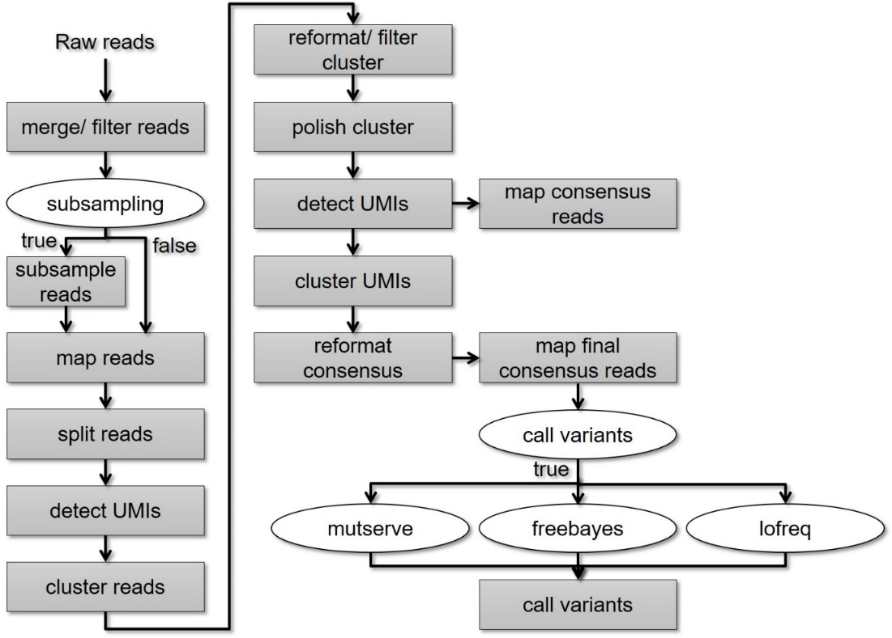

# umi-pipeline-nf Output
This document describes the output produced by the pipeline.

## Pipeline overview
The pipeline is built using [Nextflow](https://www.nextflow.io/) and processes data using the following steps:

* [Merge and Filter Reads](#merge-and-filter-reads) - Merge and filter input fastq files
* [Subsample Reads](#subsampling) - Subsample merged and filtered reads
* [Align Reads](#align-and-filter-reads) - Align all reads to the reference genome
* [Extract UMI](#extract-umi-sequences) - Extract UMI sequences of all reads
* [Cluster UMI](#cluster-umi-sequences) - Cluster UMI sequences per amplicon  
* [Filter UMI cluster](#filter-umi-clusters) - Filter UMI sequences per cluster  
* [Polish cluster](#polish-cluster) - Polish clusters and extract consensus reads per cluster
* [Align Consensus Reads](#align-consensus-reads) - Align all consensus reads to the reference genome 
* [Extract UMIs](#extract-umis) - Extract UMI sequences of consensus reads
* [Cluster Consensus Reads](#cluster-consensus-reads) - Cluster consensus reads by their UMIs 
* [Parse Consensus Clusters](#parse-consensus-clusters) - Parse consensus reads of the clusters
* [Align Final Consensus Reads](#align-final-consensus-reads) - Align all consensus reads to the reference genome 
* [Call Variants](#call-variants) - Perform a variant calling of consensus reads (optional)
* [Pipeline Info](#pipeline-info) - reports from nextflow about the pipeline run

## Merge and Filter Reads
Input fastq files will be merged and filtered - if specified by user - using catfishq.

## Subsampling
If specified by user the merged and filtered reads will be subsampled using seqtk sample.   
**Output directory: `<output>/<barcodeXX>/subsampling/`**

Information regarding subsampling will be saved in a tsv file.   
**Output directory: `<output>/<barcodeXX>/stats/`**

## Align and Filter Reads
Merged - filtered and subsampled - reads will be aligned to the provided reference genome using minimap2.
The aligned reads are filtered for primary alignment and to have more than 90 % overlap with the reference sequence using a [python script](https://github.com/AmstlerStephan/umi-pipeline-nf/blob/update-Readme/bin/filter_reads.py) and split by filter reason.   
**Output directory: `<output>/<barcodeXX>/align/<type>/`**

## Extract UMI Sequences
The UMI sequences are extracted from the filtered and aligned reads. The raw reads are written into the header of the FASTQ/A file and the extarcted UMIs are saved as read sequence using a [python script](https://github.com/AmstlerStephan/umi-pipeline-nf/blob/update-Readme/bin/extract_umis.py).    
**Output directory: `<output>/<barcodeXX>/<fasta/fastq>_umi/<type>/`**

## Cluster UMI Sequences
The reads are clustered by their UMI sequences using vsearch.   
**Output directory: `<output>/<barcodeXX>/clustering/<type>/`**

## Filter UMI Clusters
The clusters are filtered to contain only reads with a defined hamming distance (default: 3).   
**Output directory: `<output>/<barcodeXX>/clustering/<type>/`**

Clusters with less than a minimal number of reads are excluded. 
Clusters with more than a maximal number of reads are downsampled, keeping only highest quality reads.
Clusters are parsed and written into single files for cluster polishing.   
**Output directory: `<output>/<barcodeXX>/clustering/<type>/clusters`**

Stats of every cluster are documented.   
**Output directory: `<output>/<barcodeXX>/stats/<type>/`**

All steps are done using a [python script](https://github.com/AmstlerStephan/umi-pipeline-nf/blob/update-Readme/lib/processes/reformat_filter_cluster.nf)

## Polish Cluster
The clusters are polished using medaka and consensus sequences are created.   
**Output directory: `<output>/<barcodeXX>/clustering/<type>/clusters`**

## Align Consensus Reads
Consensus sequences are aligned to the reference again.   
**Output directory: `<output>/<barcodeXX>/align/<type>/`**

## Extract UMIs
Extract the UMIs of the consensus read clusters.     
**Output directory: `<output>/<barcodeXX>/<fasta/fastq>_umi/<type>/`**

## Cluster Consensus Reads
Cluster aligned consensus reads.   
**Output directory: `<output>/<barcodeXX>/clustering/<type>/`**

## Parse Consensus Clusters
Parse final consensus sequences of the consensus clusters using a [python script](https://github.com/AmstlerStephan/umi-pipeline-nf/blob/update-Readme/bin/reformat_consensus.py).   
**Output directory: `<output>/<barcodeXX>/align/<type>/`**

## Align Final Consensus Reads
Consensus sequences are aligned to the reference again.   
**Output directory: `<output>/<barcodeXX>/align/<type>/`**

## Call Variants
Call variants of the final consensus sequences.    
**Output directory: `<output>/<barcodeXX>/<freebayes/mutserve/lowfreq>/`**

## Pipeline Info
Nextflow has several built-in reporting tools that give information about the pipeline run.   
**Output directory: `<output>/nextflow_stats/`**

* `dag.svg`
  * MMD file, which can be visualized using [Mermaid](https://mermaid-js.github.io/mermaid/#/)
* `report.html`
  * Nextflow report describing parameters, computational resource usage and task bash commands used.
* `timeline.html`
  * A waterfall timeline plot showing the running times of the workflow tasks.
* `trace.txt`
  * A text file with machine-readable statistics about every task executed in the pipeline.
